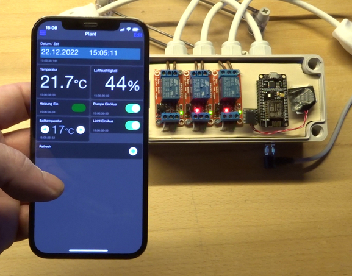

# GrowUp
Simple controller for light, pump and heating a small greenhouse. ESP8266, MQTT

 
On Youtube: https://www.youtube.com/watch?v=35i7veDfN1I  (
Sorry, the Video is in German only.)

Used Products:
- ESP8266:             
https://s.click.aliexpress.com/e/_DlM2fFZ
- Relaisboard:      
 https://s.click.aliexpress.com/e/_DEr90x9
- M8 Cable 4p:       
http://s.click.aliexpress.com/e/cgtmaWcg
- M8 Connector 4p:    http://s.click.aliexpress.com/e/bTbkFVfi

 
- Used App:      https://www.iot-onoff.com/

 
Useful:
Inexpensive but good Fluke multimeter:

https://s.click.aliexpress.com/e/_DE7D4fd

Cable set:   
https://s.click.aliexpress.com/e/_DBCMP6J

